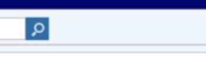

# New Epic Process for Ordering Inpatient Urine Cultures

A positive urine culture can represent a urinary tract infection (UTI) or asymptomatic bacteriuria (ASB).

This is our current urine culture order:

We will be introducing the following urine culture order soon:

This is the same image as a png:

Tiffs do not seem to work:

