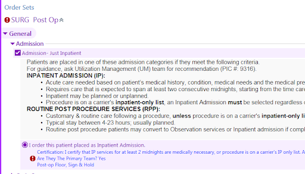
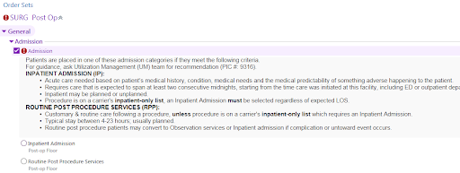

# CMS Inpatient Only Procedures

For those procedures on the CMS Inpatient Procedure List, an inpatient admission order is required for payment. A problem has been the use of other admission categories (i.e. other than inpatient) for the CMS-specified procedures for patients with CMS-derived health insurance. We have simplified the post-op admission order workflow to make choosing the correct admission category easier and more reliable. Starting on June 18th, 2019, for all patients who (a) have CMS-derived health insurance and (b) undergo a CMS-designated inpatient-only procedure, the correct admission category (i.e. inpatient) will be automatically pre-selected when you open any of the post-operative ordersets. The new order will look like this:

For all other patients (i.e. those without CMS-derived health insurance or whose procedures are not on the CMS Inpatient-Only Procedure List), the user will continue to manually select the appropriate admission category based on the patient's needs and clinical circumstances. The order will continue to look like this:

